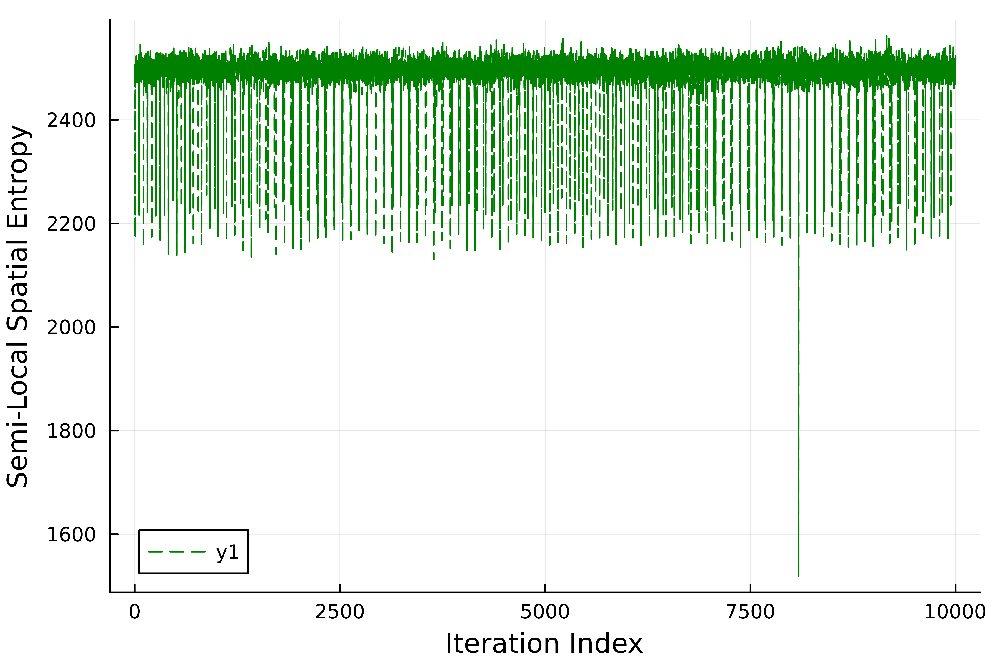

This repo documents my solutions for the 2024 Advent of Code challenge, written in Julia (and some days in R).

Highlights, 

Day 14, finding a "Christmass Tree" in a time-series data of lazy matrices (consisting of particles moving on deterministic paths), without knowing how a christmass tree looks or is oriented:

Which is achieved via a localized measure of Shannon entropy which I tangentaly ran into in the past.

(Sadly, it is a brutal overkill in this time, as we could have achievied something very similar with just measuring the spatial variance of the particles, however this one required zero manual checks of the actual frames.)

